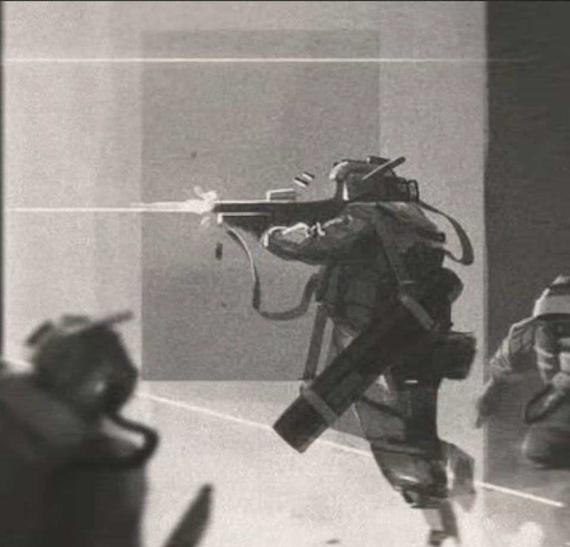

# ROADMAP
 

## 1. Игровой цикл / многопоточность
                    ┌─────────────────────┐
                    │   RENDER THREAD     │
                    │                     │
                    │ Window              │
                    │ SFML Events         │
                    │ Input               │
                    │ Camera              │
                    │ Rendering           │
                    └──────────┬──────────┘
                               │
                       Commands / Events
                               │
                               ▼
                    ┌─────────────────────┐
                    │   SIMULATION THREAD │
                    │                     │
                    │ World               │
                    │ Units               │
                    │ AI                  │
                    │ Combat              │
                    │ Movement            │
                    └──────────┬──────────┘
                               │
                         Render Snapshot
                               │
                               ▼
                    ┌─────────────────────┐
                    │   RENDER THREAD     │
                    └─────────────────────┘
- Перевести игровой цикл на несколько логических потоков.
- Определить нормальную модель распределения систем по потокам.
- Не допустить хаотичного многопотока и лишней синхронизации.
- Подготовить основу для дальнейшего масштабирования нагрузки.

---

## 2. Полноценная Z-координата

Сделать `Z` полноценной игровой механикой, а не формальной координатой.

### Требования

- Z влияет на игровую логику.
- Z корректно отображается в рендере.
- Игрок визуально и логически понимает разницу уровней.
- Игровые механики, связанные с положением объектов в мире, могут учитывать Z.

### Первый этап

- Переделать `VisibilityChecker` под новую Z-логику.
- Остальную игровую логику пока не трогать.
- Сначала закрепить корректную основу работы с высотой и видимостью.

---

## 3. Нормальные механики юнитов

Убрать временные полузатычки и начать реализовывать полноценные механики юнитов.

---

## 4. Система здоровья

Перевести текущую систему HP на более глубокую модель.

Ориентиры:

- Arma — повреждения конкретных частей тела.
- RimWorld — состояния организма и последствия повреждений.

### Основные механики

- HP отдельных частей тела.
- Повреждения частей тела.
- Сознание.
- Боль.
- Кровотечение.
- Общее состояние организма.
- Функциональные последствия повреждений.
- Влияние состояния организма на поведение и возможности юнита.

### Общая схема

```text
повреждение
    ↓
часть тела
    ↓
боль / кровотечение / функциональные последствия
    ↓
состояние организма
    ↓
состояние юнита
```

---

## 5. Переработка стрельбы

Адаптировать систему стрельбы под новую систему юнитов и переработать саму механику.

### Временные механики

- Debug-strafe отключить.
- Код не удалять.
- Оставить возможность вернуть его для отладки.

### Основная цель

Уйти от полностью математической модели:

```text
выстрел
    ↓
расчёт
    ↓
мгновенное попадание
```

Стрельба должна ощущаться как реальное взаимодействие объектов.

---

## 6. Снаряды как сущности

Сделать снаряды полноценными игровыми сущностями.

### Базовая схема

```text
оружие
    ↓
выстрел
    ↓
создание снаряда
    ↓
снаряд летит через мир
    ↓
столкновение
    ↓
результат
```

### Снаряд должен иметь

- Позицию.
- Направление.
- Скорость.
- Время жизни / дальность.
- Траекторию.
- Взаимодействие с террейном.
- Взаимодействие с юнитами.

### Архитектура должна позволять добавить

- Взрывы.
- AoE.
- Разные типы боеприпасов.
- Специальные эффекты.
- Специальное поведение отдельных типов снарядов.

---

## 7. Разные типы боеприпасов

Оружие должно определять не только количество урона, но и поведение создаваемого снаряда.

Пример:

```text
Плазмаган
    ↓
плазменный снаряд
    ↓
собственная скорость
собственная энергия
собственная модель столкновения
собственная модель пробития
собственные последствия попадания
```

Нужна основа, позволяющая добавлять новые типы оружия и боеприпасов без переписывания всей системы стрельбы.

---

## 8. Рикошеты

Сделать нормальную механику рикошетов.

Рикошет должен зависеть от реального взаимодействия с поверхностью:

- угла попадания;
- типа поверхности;
- материала;
- характеристик снаряда;
- энергии снаряда.

Не сводить механику к простой случайности:

```text
random < X%
```

Поведение должно определяться характеристиками столкновения.

---

## 9. Попадания в укрытия

Убрать текущую модель, где попадание в укрытие фактически является математической погрешностью.

### Новая модель

Снаряд должен реально взаимодействовать с террейном:

```text
стрелок
   ↓
снаряд
   ↓
[ укрытие ]
   ↓
[ цель ]
```

При столкновении определять:

- остановился ли снаряд;
- пробил ли поверхность;
- произошёл ли рикошет;
- изменилось ли направление;
- произошёл ли взрыв;
- сколько энергии осталось у снаряда.

### Зависимость от террейна

Механика должна учитывать:

- геометрию;
- материал;
- толщину;
- угол попадания;
- свойства конкретного укрытия;
- характеристики конкретного снаряда.

---

## 10. Общий принцип боевой системы

Система должна одновременно быть:

- интересной;
- визуально понятной;
- достаточно правдоподобной;
- дешёвой по CPU;
- пригодной для большого количества юнитов и снарядов.

Не нужен полноценный физический движок.

Нужна дешёвая игровая модель, которая создаёт ощущение физического взаимодействия.

---

## 11. Взрывы

Подготовить архитектуру снарядов так, чтобы поверх неё можно было нормально реализовать взрывы.

### Базовая схема

```text
снаряд
    ↓
столкновение / детонация
    ↓
взрыв
    ├── радиус
    ├── урон
    ├── воздействие на юнитов
    ├── воздействие на террейн
    └── дополнительные эффекты
```

Взрывы не обязательно реализовывать сразу, но архитектура Projectile должна позволять их добавить без переделки всей стрельбы.

---

## 12. Исследование 3D-рендера

Начать изучать возможность перехода на 3D-рендер для текущего псевдо-2D мира.

### Пока не переходить

Сначала:

- изучить техническую возможность;
- понять, как представить текущую карту в 3D;
- понять, как реализовать Z;
- оценить влияние на текущий renderer;
- определить стоимость перехода;
- понять преимущества и недостатки.

### Главный вопрос

```text
Можно ли получить преимущества 3D
для псевдо-2D мира
без превращения проекта в полноценную 3D игру?
```

---

# Порядок работы

## Этап 1 — фундамент

1. Многопоточный игровой цикл.!!Отказано!!
2. Полноценная Z-координата.+
3. Новый `VisibilityChecker`.+

## Этап 2 — юниты

4. Полноценная система здоровья.
5. Части тела.
6. Сознание.
7. Боль.
8. Кровотечение.
9. Последствия повреждений.
10.перерабортка юнитов
### концепт юнита: 


- те бобот ебот который имеет конечности имеет одежду имеет инвентарь 
- оружие наверное сделам несколько типов и не будем жахаться с полиморфизмом
## Этап 3 — стрельба

10. Переработать систему стрельбы.
11. Отключить debug-strafe, не удаляя его.
12. Ввести Projectile как сущность.
13. Сделать полёт снаряда.
14. Сделать столкновения.

## Этап 4 — взаимодействие с миром

15. Рикошеты.
16. Пробитие.
17. Взаимодействие с укрытиями.
18. Зависимость от террейна.
19. Подготовить взрывы.

## Этап 5 — контент боевой системы

20. Разные типы снарядов.
21. Специализированные боеприпасы.
22. Пример сложного оружия — плазмаган.
23. Расширение системы на другие типы оружия.

## Этап 6 — renderer

24. Исследовать 3D-рендер.
25. Проверить интеграцию с текущим псевдо-2D миром.
26. Оценить преимущества и стоимость.
27. После исследования принять решение: оставаться на 2D или переходить на 3D-рендер.


---

# Главный принцип

```text
Сложные и интересные механики
            +
дешёвые вычисления
            +
простая расширяемая архитектура
            +
хорошая визуальная обратная связь
```

Не делать механики сложными ради сложности.

Сложность должна появляться из взаимодействия простых систем.
